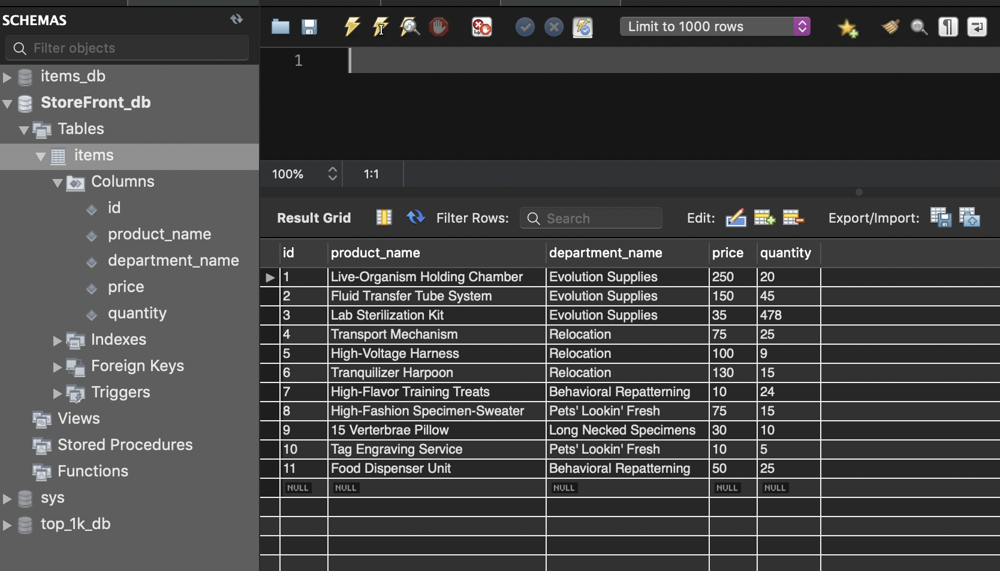
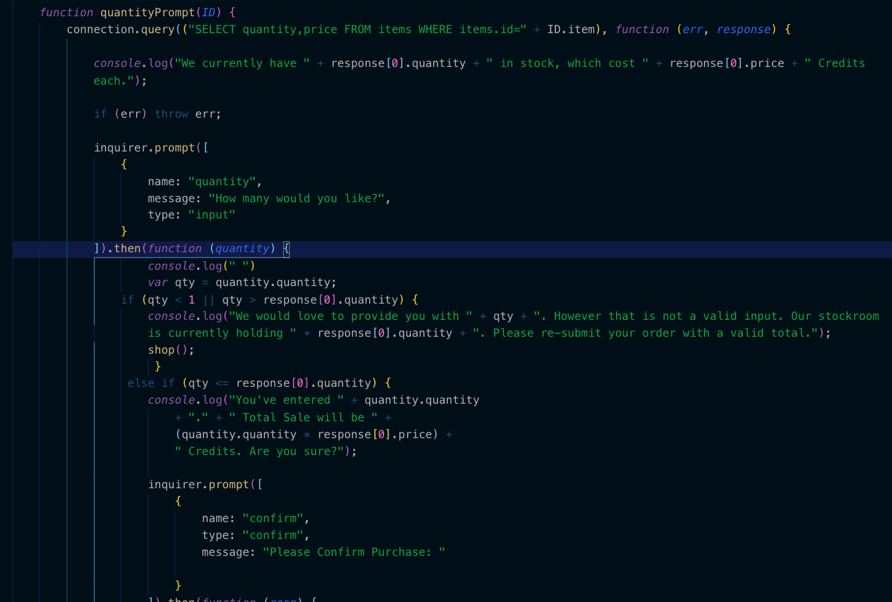

#       FUTURE PET EMPORIUM

###     Welcome to the storefront simulator!

    In this project, the goal was to build a virtual store. More specifically, a database oriented program for handling user interaction and input, with realtime updates to the products and their availability.

    To build this, I used a leapfrog-style architecture involving inquirer prompts, console logging/tabling, and database querying. The flow of the program guides the user through the necessary steps to view available items and choose which one they desire. They can progress to the next step or re-route back to the most appropriate position inside of the flow. They can then choose a quantity vs. the store's inventory and get accurate price reflection. Exactly what you'd expect from a StoreFront. 

    The MYSQL database stores all of the details regarding products, and is accessed and edited via the node package. 

    ;

## Snapshot of Data Table and Code Structure;
;
;

